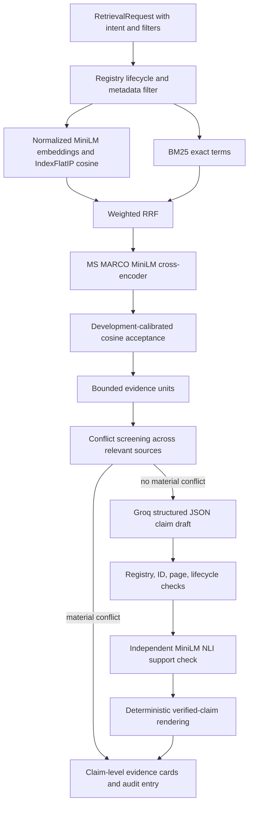

# Evidence retrieval and claim verification

Ask Evidence is a separate, general evidence workflow. It never receives `PatientContext`, and the deterministic Phase 3 rules never call a language model. The rule recommendation registry remains authoritative for those rules; extracted PDF recommendations are retrieval units only. In particular, extracting `1.3.3` from the superseded local NG19 PDF does not make that PDF current.

## Implemented path



`EvidenceUnit` distinguishes recommendation, context, and reference units. Extractor `nice-numbered-action-v3` accepts a local NICE-style recommendation only when a numbered action paragraph has a sequential neighboring numbered action in the same section. A bare decimal, page number, table reference, or prose citation cannot create a recommendation unit. The extractor retains document/version, page range, section, source chunk IDs, and extractor version. Rejected ambiguous markers remain available only through their ordinary context chunks. `data/recommendation_extraction_report.json` records extraction counts; `data/rule_evidence_registry.json` is unchanged and separate.

The indexed and query embeddings both use `SentenceTransformer("all-MiniLM-L6-v2", normalize_embeddings=True)`. FAISS `IndexFlatIP` on unit vectors implements cosine similarity. The manifest records model, dimension 384, L2 normalization, cosine/inner-product metric, index type, evidence schema, extractor version, evidence-unit hash, source versions, and artifact hashes. The old L2 index manifest fails validation. Rebuild with:

```bash
python -m embeddings.recommendation_extractor
python -m embeddings.build_faiss_index
python -m backend.index_provenance
```

The retrieval request supports clinical guidance, reference explanation, and historical intent. The public endpoint fixes lifecycle policy from intent; internal callers may use an explicit legacy policy. Filtering by lifecycle, source type, jurisdiction, document, version, recommendation ID, and unit type happens before cosine, BM25, fusion, gating, or reranking. Current clinical mode requires an ingested current guideline. Reference mode permits reference sources without presenting them as current treatment guidance. Historical mode permits superseded/historical versions and marks them in the UI.

The injectable `DenseCandidateRetriever` and `BM25CandidateRetriever` interfaces return ranked candidate IDs and raw scores. Each contributes at most 30 candidates. BM25 tokenization keeps `NG136`, `ACEi`, `SINBAD`, and `HbA1c` as exact lowercased tokens. Weighted RRF uses dense weight 0.7, BM25 weight 1.0, and rank constant 60. Rank and raw-score provenance are preserved. A local `cross-encoder/ms-marco-MiniLM-L-6-v2` reranks up to 30 fused candidates to the requested `top_k`. Its output is called `reranker_score`, never a confidence percentage. If it cannot load, the service uses RRF order and reports `reranker_used=false`.

The acceptance gate uses the strongest eligible cosine similarity, with a 0.40 floor selected from the development split in `eval/calibration_report.json`. It is an abstention heuristic, not a probability. The held-out set was not used to set it. BM25 cannot rescue an out-of-domain query based on incidental word overlap.

## Generation, verification, and conflicts

The generator receives a fixed system instruction and JSON-escaped evidence in an explicit untrusted-data boundary. It produces a JSON object containing an abstention or claims with exact evidence IDs. Pydantic validation rejects malformed JSON, duplicate claim IDs, empty grounded claims, and claims without evidence IDs. One malformed-output repair attempt is allowed. Groq has a 20-second request timeout and one provider retry. Provider errors fail closed.

Before semantic checking, the verifier checks that every ID belongs to this retrieval result, resolves to its registered document/version, has page metadata, and remains eligible for the selected lifecycle policy. The independent `cross-encoder/nli-MiniLM2-L6-H768` model checks each cited unit individually using a bounded passage stored on that claim and displayed in its evidence card. Multiple claims citing one unit retain their own passages. **Every cited unit must independently support the claim.** Entailment must exceed the conservative 0.85 softmax threshold; uncertain or unsupported claims are removed. If the model is unavailable, no claim is marked supported. These scores are internal model signals, not clinical confidence.

Before generation, conflict screening checks source distinction, topic overlap, and material opposition around routine annual testing. An optional NLI contradiction check catches additional same-topic differences. Cross-jurisdiction compatible claims are jurisdiction-labelled in the answer; materially conflicting units return `status=conflict` with separate evidence cards and no selected winner. This is deliberately conservative and does not cover every kind of clinical disagreement.

The final answer is rendered from supported claim text, never the raw generator response. If none survive, it abstains. Unsupported draft text is absent from the public response; claim IDs and statuses remain in the local hash-chain audit entry. Legacy `/api/ask` calls this same service and derives its `sources` and `citations` only from evidence supporting surviving claims. The versioned `POST /v1/evidence/query` returns typed status, claims, conflicts, evidence references, and bounded retrieval diagnostics.

## Evaluation

`eval/retrieval_cases.jsonl` has separate development and held-out queries covering current guideline, exact-term, reference, historical, stale-source, and out-of-domain cases. `eval/benchmark.py` reconstructs the previous committed L2 index from starting SHA `c35bdf82bfdcc1ace686b190cc577f3f9ddba5c7` and evaluates it and Phase 4 on the same held-out cases. Document-level Recall@5, Recall@10, MRR, and nDCG@10 are computed only on answerable cases, with duplicate documents collapsed before ranking metrics. Three recommendation-level labels separately test reranker value. `eval/grounding_cases.jsonl` contains synthetic support, contradiction, and insufficient-evidence pairs. The grounding benchmark reports false-supported rate and citation precision/recall. `eval/scenarios.py` exercises the real local retriever and NLI verifier using a fake generator, so no Groq key is needed.

`node eval/ui_smoke.js` exercises claim cards, HTML escaping, conflicts, abstention, and the historical warning with a small DOM stub. It does not test browser layout or CSS.

These are small local engineering test sets. Their scores are not clinical accuracy or external validation. The first model load and download are excluded from warm latency medians; machine and model availability should accompany any reported latency. The NLI model is about 328 MB and the reranker about 91 MB on disk; both add CPU startup and query time. A host without either model can still retrieve with RRF, but cannot return a grounded answer without semantic verification.

## Known limits

- NICE PDF extraction is narrow and may retain or omit awkward page text. Recheck extracted recommendation text against the governed source before relying on it.
- A verifier can reject valid paraphrases; a synthetic false-supported rate of zero does not prove clinical reliability. It can also miss contradictions outside its training distribution.
- Evidence spanning multiple passages is conservatively rejected unless each cited passage supports the claim independently.
- Conflict detection recognizes limited patterns and NLI disagreement; it does not resolve guideline precedence.
- The corpus has only a few current guideline documents. The held-out query set and citation labels are small.
- Groq structured output still depends on provider availability. Provider responses never bypass local validation and verification.
