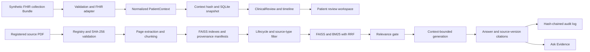

<div align="center">

# Medical AI Copilot — Synthetic Patient Review and Governed Evidence

**A medical AI copilot prototype combining governed evidence retrieval with structured synthetic patient-context review.**

[](https://www.python.org/)
[](https://streamlit.io/)
[](https://faiss.ai/)
[](https://pypi.org/project/rank-bm25/)
[](https://groq.com/)
[](https://medical-ai-copilot-usov2kkptkqwcbpgzappudd.streamlit.app/)

[**Live Demo**](https://medical-ai-copilot-usov2kkptkqwcbpgzappudd.streamlit.app/) · [Architecture](#-architecture) · [User Interface](#-user-interface) · [Installation](#-installation) · [Limitations](#-known-limitations)

> ⚕️ *For educational and research purposes only. Not a substitute for professional medical advice.*

</div>

---

## Table of Contents

- [The Problem](#-the-problem)
- [The Solution](#-the-solution)
- [Features](#-features)
- [Design Principles](#-design-principles)
- [Architecture](#-architecture)
- [Why Hybrid Retrieval](#-why-hybrid-retrieval)
- [User Interface](#-user-interface)
- [Installation](#-installation)
- [Running the Project](#-running-the-project)
- [Example Output](#-example-output)
- [Engineering Highlights](#-engineering-highlights)
- [Indexed Sources](#-indexed-sources)
- [Deployment](#-deployment)
- [Project Structure](#-project-structure)
- [Technologies](#-technologies)
- [Known Limitations](#-known-limitations)
- [Roadmap](#-roadmap)
- [Disclaimer](#-disclaimer)
- [Contact](#-contact)

---

## The Problem

Large Language Models hallucinate. When they generate medical information from parametric memory alone, they produce fluent, confident, and occasionally wrong clinical guidance — with no way for the reader to check where any of it came from.

In healthcare, factual reliability and **traceability** are not nice-to-haves. An answer you cannot source is an answer you cannot use.

## The Solution

The primary workspace now loads fictional FHIR R4-compatible patient Bundles, normalizes them into a typed patient context, and creates reproducible review snapshots. It shows supplied conditions, medications, allergies, observations, encounters, a deterministic timeline, and record availability. [Patient context documentation](PATIENT_CONTEXT.md) describes the supported subset and limitations. Clinical rule evaluation, diagnosis, and treatment recommendations are not implemented.

Ask Evidence remains available as a separate general question workflow. Patient records are not automatically provided to it.

A RAG pipeline that traces retrieved context to a registered source version and page:

```
Question -> registry policy filter -> hybrid retrieval (FAISS + BM25/RRF) -> relevance gate -> generation -> context citations + audit entry
```

- Default retrieval uses only registered, ingested current clinical guidelines; historical and reference evidence require explicit policies
- The generation prompt instructs the model to use retrieved context; individual generated claims are not independently checked
- Returns page-level citations for retrieved context; individual generated claims are not independently verified
- Refuses cleanly, **with no LLM call at all**, when nothing relevant is indexed
- Logs every interaction to a **hash-chained, tamper-evident** audit trail

## Features

**Synthetic patient review**
- Five bundled fictional patients can be selected; supported synthetic collection Bundles can also be imported.
- Normalized patient context, stable content hash, local SQLite persistence, deterministic timeline, and immutable review snapshots.
- Streamlit and the alternative HTML client place patient review first, with Ask Evidence and source visibility in separate tabs.

**Retrieval**
- **Policy-aware dual-index retrieval**: only eligible source versions enter the selected FAISS/BM25 view; historical and reference modes are explicit.
- **Hybrid search within the selected index** — FAISS semantic + BM25 keyword, fused via **Reciprocal Rank Fusion**
- **Relevance gate** — genuinely out-of-scope questions return a clean "I don't have relevant information" response with **zero LLM calls** (no cost, no hallucination surface)

**Grounding & Citation**
- Page-level citations grouped per document with combined ranges — e.g. `NICE NG19 — Diabetic Foot Problems · pp.6-7, 13-15`
- Generation prompt explicitly engineered to prevent **self-contradiction** (answering confidently, then hedging or reversing) — a real failure mode found, reproduced, and fixed with a before/after eval set

**Auditability**
- **Hash-chained SQLite audit log** — every interaction links to the previous entry's hash, so modifying or deleting any past record breaks the chain detectably
- Tamper-detection property **verified by deliberately corrupting the log** and confirming the break was caught — not assumed to work

**Deployment Engineering**
- **Environment-variable-first secrets resolution**, matching how AWS/Azure/GCP secrets managers actually deliver credentials, with `st.secrets` fallback — the same code path runs unchanged locally and in the cloud
- Custom Streamlit theming (no default component styling)

## Design Principles

1. **Grounding over completeness.** The system answers from eligible indexed context or says it can't. Filling gaps with unrestricted LLM knowledge would defeat the entire purpose.
2. **Context is traceable.** Retrieved chunks have page and source-version provenance; generated claims are not yet checked individually.
3. **Refuse cheaply.** The relevance gate short-circuits before the LLM, not after — out-of-scope questions cost nothing and can't hallucinate.
4. **Auditability is tested, not asserted.** The tamper-evidence property was verified adversarially.
5. **Debug by reproduction.** Every retrieval fix in this repo came from reproducing a real failure and measuring it — the `debug_*.py` scripts are kept in-tree as evidence.

## Architecture

The [knowledge governance guide](KNOWLEDGE_GOVERNANCE.md) contains the corpus audit, lifecycle policy, and rebuild procedure. The [patient context guide](PATIENT_CONTEXT.md) describes the supported FHIR subset and review snapshots.



The original two-index storage keeps the large anatomy textbook separate from the other sources. At query time, policy filtering selects eligible vectors before semantic or lexical ranking. This prevents historical reports and the superseded NG28 snapshot from influencing the default clinical search.

## Why Hybrid Retrieval

Pure semantic search fails on precisely the vocabulary that clinical questions depend on:

| Query type | Example | FAISS alone | BM25 alone |
|---|---|---|---|
| Drug abbreviations | `ACEi`, `ARB` | ❌ weak in embedding space | ✅ exact match |
| Guideline codes | `NG19`, `NG136` | ❌ near-meaningless as vectors | ✅ exact match |
| Named classifications | `SINBAD` | ❌ unseen token | ✅ exact match |
| Mechanism questions | *"explain insulin resistance"* | ✅ conceptual match | ❌ no keyword overlap |

Neither method is sufficient alone. Fusing both via RRF was a real fix for a real, reproducible failure found during testing — not a default architecture choice.

## User Interface

The Streamlit workspace opens on **Patients**, where a bundled synthetic patient or supported JSON Bundle can be imported. **Clinical Review** creates and displays a persisted snapshot. **Ask Evidence** retains the governed general Q&A path, and **Knowledge Sources** shows registered lifecycle states. The alternative HTML client provides the same main workflow through the versioned API.

Older screenshots in `assets/screenshots/` depict the earlier evidence-only interface and should not be read as pictures of the current patient workspace.

## Installation

**Requirements:** Python 3.11+. A [Groq](https://groq.com/) API key is needed only for generated Ask Evidence answers; patient review and deterministic tests do not use it.

```bash
git clone https://github.com/Stevemeg/medical-ai-copilot.git
cd medical-ai-copilot

python -m venv venv
# Windows: .\venv\Scripts\Activate.ps1  |  Linux/macOS: source venv/bin/activate
pip install -r requirements.txt
```

For development checks, use `pip install -r requirements-dev.txt` and run `pytest`. The registry and committed index provenance can be checked without an LLM key using `python -m backend.source_registry` and `python -m backend.index_provenance`.

**For generated Ask Evidence answers**, create `.streamlit/secrets.toml`:

```toml
GROQ_API_KEY = "your_api_key"
```

Or set `GROQ_API_KEY` as a real environment variable — `backend/config.py` checks `os.environ` first.

## Running the Project

```bash
streamlit run app.py
```

**Rebuilding the indexes** (required after a registered source or parser/chunker change; see [knowledge governance](KNOWLEDGE_GOVERNANCE.md)):

```bash
python -m embeddings.extract_text        # PDFs → page-tracked JSON
python -m embeddings.chunk_text          # JSON → token-bounded chunks
python -m embeddings.build_faiss_index   # Build dual FAISS indexes
```

**Retrieval diagnostics** — the debug scripts used to find and fix real retrieval bugs are kept in-tree:

```bash
python -m embeddings.calibrate_threshold      # Relevance-gate threshold calibration
python -m embeddings.compare_embeddings       # Embedding model comparison
python -m embeddings.eval_generation_quality  # Before/after generation eval set
python -m embeddings.debug_bm25_gap           # BM25 vs FAISS coverage gaps
```

## Example Output

Illustrative output from an earlier demo run; generated wording and cited pages may vary after lifecycle filtering.

```
Q: What is the SINBAD classification?

ANSWER
SINBAD is a classification system for diabetic foot ulcers, scoring six
elements — Site, Ischaemia, Neuropathy, Bacterial infection, Area, and
Depth — each contributing to a total severity score used to guide
management decisions.

SOURCES
  NICE NG19 — Diabetic Foot Problems · pp.13-15

─────────────────────────────────────────────────────────────
Q: What is the capital of France?

ANSWER
I don't have relevant information in the indexed clinical guidelines to
answer this question.

[relevance gate triggered — 0 LLM calls made]
```

## Engineering Highlights

- **RAG with genuine hybrid retrieval**, not vector search alone — with a documented reason for each half
- **Real multi-stage pipeline debugging**: diagnosed and fixed a corpus-imbalance bug, a relevance-threshold miscalibration, and a Reciprocal-Rank-Fusion design flaw — each found through actual reproduction and measurement
- **Prompt engineering against a measured failure mode** — self-contradicting answers, fixed and verified with a before/after eval set
- **Tamper-evident audit logging** with the tamper-detection property adversarially tested
- **Cloud-realistic secrets management** with a documented migration path per provider
- **Honest compliance analysis** (HIPAA / FDA CDS) in `COMPLIANCE_CONSIDERATIONS.md`, including catching and correcting an outdated regulatory reference during writing
- Public demo deployment on Streamlit Community Cloud

## Indexed Sources

Default clinical retrieval includes the registered current NICE NG19, NG136, and NG238 snapshots. The older NG28 PDF, WHO reports, CDC article, India MoHFW FAQ, and OpenStax textbook remain registered for explicit historical or reference access. See the [source inventory and lifecycle](KNOWLEDGE_GOVERNANCE.md#corpus-audit-verified-24-september-2026).

## Deployment

Deployed on **Streamlit Community Cloud**. The FAISS indexes are committed to the repository rather than rebuilt at deploy time — a deliberate choice: rebuilding on every cold start would require the raw source PDFs to be present and would add real startup latency, while startup validates source hashes and index manifests. Rebuild whenever the registered corpus changes.

**Secrets:** `GROQ_API_KEY` is set via Streamlit Cloud's Secrets management. `backend/config.py` checks `os.environ` first — which is how Streamlit Cloud actually exposes root-level secrets — before falling back to `st.secrets`, so the same code path works unchanged in both environments.

## Project Structure

```
medical-ai-copilot/
│
├── app.py                          # Streamlit UI (primary interface)
├── api_server.py                   # Standalone API server (alternative frontend path)
├── requirements.txt
├── COMPLIANCE_CONSIDERATIONS.md    # HIPAA/FDA CDS analysis (educational, not legal advice)
├── FRONTEND_SETUP.md               # Custom HTML/CSS/JS frontend setup notes
│
├── .streamlit/
│   └── config.toml                 # Custom theme (secrets.toml is gitignored)
│
├── backend/
│   ├── rag_pipeline.py             # Prompting, generation, answer assembly
│   ├── fhir_adapter.py              # Supported FHIR R4 subset validation and normalization
│   ├── patient_models.py            # Typed patient and review domain records
│   ├── patient_context.py           # Context hash, queries, timeline, availability
│   ├── patient_store.py             # Local SQLite patient and review snapshots
│   ├── patient_api.py               # Versioned synthetic patient API
│   ├── config.py                   # Secrets resolution (env var → secrets.toml)
│   └── audit_log.py                # Tamper-evident hash-chained audit log
│
├── embeddings/
│   ├── extract_text.py             # PDF → page-tracked JSON
│   ├── chunk_text.py               # JSON → token-bounded chunks with page ranges
│   ├── build_faiss_index.py        # Builds dual (clinical/anatomy) FAISS indexes
│   ├── retrieve.py                 # Hybrid BM25 + FAISS retrieval, RRF fusion
│   ├── calibrate_threshold.py      # Relevance-gate threshold calibration
│   ├── compare_embeddings.py       # Embedding model comparison
│   ├── eval_generation_quality.py  # Before/after generation-quality eval
│   └── debug_*.py                  # Reproduction scripts for real retrieval bugs
│
├── frontend/
│   └── index.html                  # Alternative patient review frontend served with the API
│
├── assets/
│   ├── architecture.png
│   └── screenshots/
│
└── data/
    ├── raw_docs/                   # Source PDFs
    ├── processed/                  # Page-tracked extracted text
    ├── synthetic_fhir/             # Five fictional demo Bundles
    └── vector_store/
        ├── clinical_faiss.index / clinical_metadata.json
        └── anatomy_faiss.index / anatomy_metadata.json
```

## Technologies

| Component | Technology |
|---|---|
| Language | Python |
| Frontend | Streamlit (custom theme, no default component styling) |
| Embeddings | SentenceTransformers (MiniLM) |
| Vector Store | FAISS — dual index (clinical + anatomy) |
| Keyword Search | BM25 (`rank_bm25`), fused via Reciprocal Rank Fusion |
| LLM Inference | Groq API — Llama 3.1 8B |
| Audit Logging | SQLite, hash-chained for tamper-evidence |
| Secrets | Environment-variable-first, `.streamlit/secrets.toml` fallback |
| Deployment | Streamlit Community Cloud |

## Known Limitations

These are stated plainly rather than buried — each is a real constraint of the current build.

- **Corpus-bounded answers.** Responses are limited to indexed documents. This is a deliberate design choice (grounding over completeness), not a gap to be filled with unrestricted LLM knowledge.
- **Not for clinical use.** Not intended for diagnosis or treatment decisions — see `COMPLIANCE_CONSIDERATIONS.md` for an honest (non-legal) analysis of what real clinical deployment would require.
- **Cross-guideline reconciliation (open issue).** Certain queries retrieve a chunk from a topically adjacent guideline, which the model sometimes tries to incorrectly cross-reference rather than ignore. This remains an open limitation; page-level context citations do not verify every generated claim.
- **Ephemeral audit storage on free tier.** The hash-chaining is real and tested, but Streamlit Community Cloud's filesystem resets on redeploy. The code is correct; this hosting tier doesn't give it persistent storage.
- **Local synthetic patient storage.** SQLite persists between local requests, but hosted filesystems may reset and there is no authentication. Do not import real patient records.
- **Cold-start latency** on free-tier deployment.

## Roadmap

Phase 1 established governed source versions and lifecycle-aware retrieval. Phase 2 adds synthetic patient context and review snapshots. Clinical rules, real patient integration, and production security are outside this build.

## Disclaimer

This project provides informational responses based on indexed medical documents and is intended for **educational and research purposes only**. It does not provide patient-specific diagnosis, treatment decisions, or professional healthcare advice. Always consult a qualified healthcare professional.

## Contact

**Kona Bharath Vamshidhar Reddy**
B.E. Artificial Intelligence & Machine Learning · Acharya Institute of Technology
[konabharath2004@gmail.com](mailto:konabharath2004@gmail.com) · [LinkedIn](https://www.linkedin.com/in/kona-bharath-vamshidhar-reddy/) · [GitHub](https://github.com/Stevemeg)

---

<div align="center"><sub>An answer you can't source is an answer you can't use.</sub></div>
