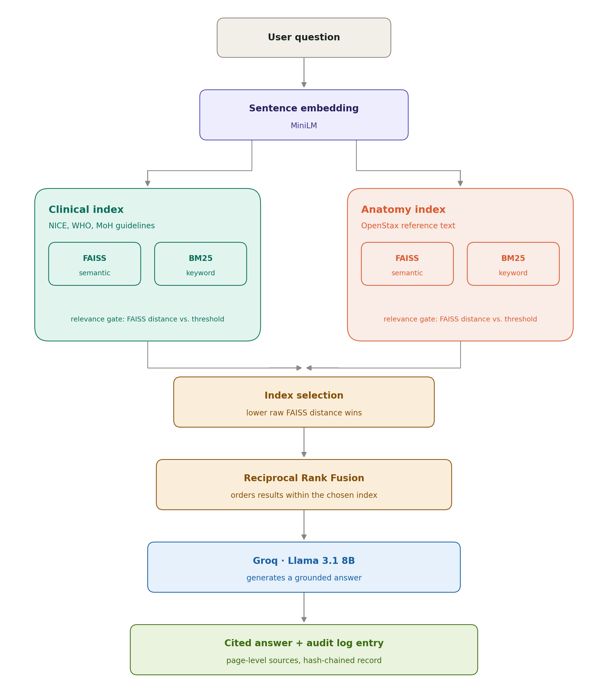
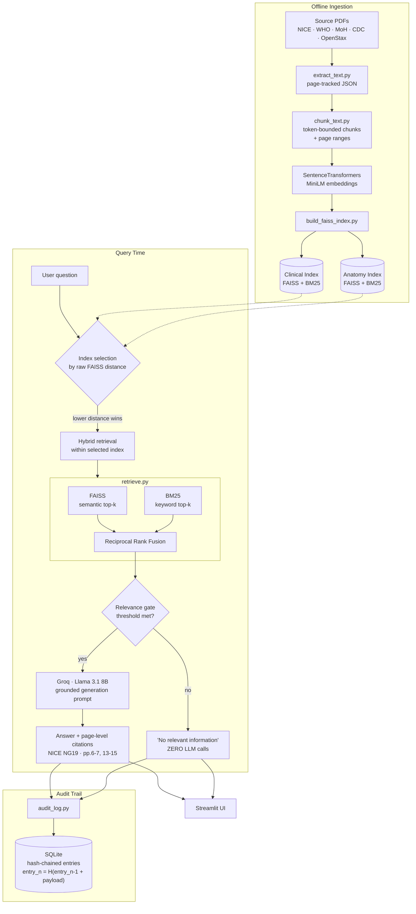

<div align="center">

# Medical AI Copilot — RAG Clinical Assistant

**A Retrieval-Augmented Generation system that answers clinical questions from indexed medical guidelines — with dual-index hybrid retrieval, page-level source citations, a zero-LLM-call relevance gate, and a tamper-evident hash-chained audit trail.**

[](https://www.python.org/)
[](https://streamlit.io/)
[](https://faiss.ai/)
[](https://pypi.org/project/rank-bm25/)
[](https://groq.com/)
[](https://medical-ai-copilot-usov2kkptkqwcbpgzappudd.streamlit.app/)

[**Live Demo**](https://medical-ai-copilot-usov2kkptkqwcbpgzappudd.streamlit.app/) · [Architecture](#-architecture) · [User Interface](#-user-interface) · [Installation](#-installation) · [Limitations](#-known-limitations)

> ⚕️ *For educational and research purposes only. Not a substitute for professional medical advice.*

</div>

---

## Table of Contents

- [The Problem](#-the-problem)
- [The Solution](#-the-solution)
- [Features](#-features)
- [Design Principles](#-design-principles)
- [Architecture](#-architecture)
- [Why Hybrid Retrieval](#-why-hybrid-retrieval)
- [User Interface](#-user-interface)
- [Installation](#-installation)
- [Running the Project](#-running-the-project)
- [Example Output](#-example-output)
- [Engineering Highlights](#-engineering-highlights)
- [Indexed Sources](#-indexed-sources)
- [Deployment](#-deployment)
- [Project Structure](#-project-structure)
- [Technologies](#-technologies)
- [Known Limitations](#-known-limitations)
- [Roadmap](#-roadmap)
- [Disclaimer](#-disclaimer)
- [Contact](#-contact)

---

## The Problem

Large Language Models hallucinate. When they generate medical information from parametric memory alone, they produce fluent, confident, and occasionally wrong clinical guidance — with no way for the reader to check where any of it came from.

In healthcare, factual reliability and **traceability** are not nice-to-haves. An answer you cannot source is an answer you cannot use.

## The Solution

A RAG pipeline built so that every answer is anchored to a specific page of a specific trusted guideline:

```
Question → dual-index selection → hybrid retrieval (FAISS + BM25 → RRF) → relevance gate → grounded generation → cited answer + audit entry
```

- Retrieves **only** from a fixed, indexed corpus of trusted clinical guidelines
- Grounds every answer in retrieved context — never outside knowledge
- Cites **page-level** sources for every claim
- Refuses cleanly, **with no LLM call at all**, when nothing relevant is indexed
- Logs every interaction to a **hash-chained, tamper-evident** audit trail

## Features

**Retrieval**
- **Dual-index architecture** — clinical guidelines and anatomy/physiology reference are indexed *separately*, with the correct index selected per query by raw FAISS distance
- **Hybrid search within the selected index** — FAISS semantic + BM25 keyword, fused via **Reciprocal Rank Fusion**
- **Relevance gate** — genuinely out-of-scope questions return a clean "I don't have relevant information" response with **zero LLM calls** (no cost, no hallucination surface)

**Grounding & Citation**
- Page-level citations grouped per document with combined ranges — e.g. `NICE NG19 — Diabetic Foot Problems · pp.6-7, 13-15`
- Generation prompt explicitly engineered to prevent **self-contradiction** (answering confidently, then hedging or reversing) — a real failure mode found, reproduced, and fixed with a before/after eval set

**Auditability**
- **Hash-chained SQLite audit log** — every interaction links to the previous entry's hash, so modifying or deleting any past record breaks the chain detectably
- Tamper-detection property **verified by deliberately corrupting the log** and confirming the break was caught — not assumed to work

**Deployment Engineering**
- **Environment-variable-first secrets resolution**, matching how AWS/Azure/GCP secrets managers actually deliver credentials, with `st.secrets` fallback — the same code path runs unchanged locally and in the cloud
- Custom Streamlit theming (no default component styling)

## Design Principles

1. **Grounding over completeness.** The system answers from the indexed corpus or says it can't. Filling gaps with unrestricted LLM knowledge would defeat the entire purpose.
2. **Every claim is traceable.** Page-level citations, not document-level hand-waving.
3. **Refuse cheaply.** The relevance gate short-circuits before the LLM, not after — out-of-scope questions cost nothing and can't hallucinate.
4. **Auditability is tested, not asserted.** The tamper-evidence property was verified adversarially.
5. **Debug by reproduction.** Every retrieval fix in this repo came from reproducing a real failure and measuring it — the `debug_*.py` scripts are kept in-tree as evidence.

## Architecture



<details>
<summary><b>Detailed pipeline view (Mermaid)</b></summary>



</details>

**Why two indexes instead of one:** during early development, a large anatomy/physiology textbook was indexed alongside much smaller clinical guideline documents. The textbook's sheer chunk volume dominated retrieval for clinical questions — a corpus-imbalance bug found by reproduction, not assumption. Splitting into two indexes and selecting per-query by FAISS distance fixed it structurally rather than by threshold-tuning around it.

## Why Hybrid Retrieval

Pure semantic search fails on precisely the vocabulary that clinical questions depend on:

| Query type | Example | FAISS alone | BM25 alone |
|---|---|---|---|
| Drug abbreviations | `ACEi`, `ARB` | ❌ weak in embedding space | ✅ exact match |
| Guideline codes | `NG19`, `NG136` | ❌ near-meaningless as vectors | ✅ exact match |
| Named classifications | `SINBAD` | ❌ unseen token | ✅ exact match |
| Mechanism questions | *"explain insulin resistance"* | ✅ conceptual match | ❌ no keyword overlap |

Neither method is sufficient alone. Fusing both via RRF was a real fix for a real, reproducible failure found during testing — not a default architecture choice.

## User Interface

A custom-themed Streamlit interface — question input, grounded answer, and expandable page-level citations for every response.

| Query & grounded answer | Source citations |
|---|---|
|  |  |

| Relevance gate (out-of-scope refusal) | Audit trail |
|---|---|
|  |  |

**Interface flow**

```
┌──────────────────────────────────────────────────────────────┐
│  Medical AI Copilot                                          │
├──────────────────────────────────────────────────────────────┤
│  Ask a clinical question:                                    │
│  ┌────────────────────────────────────────────────────────┐  │
│  │ How should a diabetic foot ulcer be managed?           │  │
│  └────────────────────────────────────────────────────────┘  │
│                                          [ Ask ]             │
├──────────────────────────────────────────────────────────────┤
│  ANSWER                                                      │
│  Management follows a structured assessment pathway…         │
│                                                              │
│  ▸ SOURCES                                                   │
│    NICE NG19 — Diabetic Foot Problems · pp.6-7, 13-15        │
│    MoH Diabetes Mellitus Guideline · pp.22                   │
└──────────────────────────────────────────────────────────────┘
```

**Example questions to try**
- How should a diabetic foot ulcer be managed?
- When should statins be offered for cardiovascular risk reduction?
- What is the SINBAD classification?
- Explain insulin resistance.

## Installation

**Requirements:** Python 3.10+ · a [Groq](https://groq.com/) API key

```bash
git clone https://github.com/Stevemeg/medical-ai-copilot.git
cd medical-ai-copilot

python -m venv venv
# Windows: .\venv\Scripts\Activate.ps1  |  Linux/macOS: source venv/bin/activate
pip install -r requirements.txt
```

**Add secrets** — create `.streamlit/secrets.toml`:

```toml
GROQ_API_KEY = "your_api_key"
```

Or set `GROQ_API_KEY` as a real environment variable — `backend/config.py` checks `os.environ` first.

## Running the Project

```bash
streamlit run app.py
```

**Rebuilding the indexes** (only needed if you change the source corpus):

```bash
python -m embeddings.extract_text        # PDFs → page-tracked JSON
python -m embeddings.chunk_text          # JSON → token-bounded chunks
python -m embeddings.build_faiss_index   # Build dual FAISS indexes
```

**Retrieval diagnostics** — the debug scripts used to find and fix real retrieval bugs are kept in-tree:

```bash
python -m embeddings.calibrate_threshold      # Relevance-gate threshold calibration
python -m embeddings.compare_embeddings       # Embedding model comparison
python -m embeddings.eval_generation_quality  # Before/after generation eval set
python -m embeddings.debug_bm25_gap           # BM25 vs FAISS coverage gaps
```

## Example Output

```
Q: What is the SINBAD classification?

ANSWER
SINBAD is a classification system for diabetic foot ulcers, scoring six
elements — Site, Ischaemia, Neuropathy, Bacterial infection, Area, and
Depth — each contributing to a total severity score used to guide
management decisions.

SOURCES
  NICE NG19 — Diabetic Foot Problems · pp.13-15

─────────────────────────────────────────────────────────────
Q: What is the capital of France?

ANSWER
I don't have relevant information in the indexed clinical guidelines to
answer this question.

[relevance gate triggered — 0 LLM calls made]
```

## Engineering Highlights

- **RAG with genuine hybrid retrieval**, not vector search alone — with a documented reason for each half
- **Real multi-stage pipeline debugging**: diagnosed and fixed a corpus-imbalance bug, a relevance-threshold miscalibration, and a Reciprocal-Rank-Fusion design flaw — each found through actual reproduction and measurement
- **Prompt engineering against a measured failure mode** — self-contradicting answers, fixed and verified with a before/after eval set
- **Tamper-evident audit logging** with the tamper-detection property adversarially tested
- **Cloud-realistic secrets management** with a documented migration path per provider
- **Honest compliance analysis** (HIPAA / FDA CDS) in `COMPLIANCE_CONSIDERATIONS.md`, including catching and correcting an outdated regulatory reference during writing
- End-to-end production deployment on Streamlit Community Cloud

## Indexed Sources

NICE NG19 (Diabetic Foot Problems) · NICE NG136 (Hypertension) · NICE NG238 (Cardiovascular Risk & Lipids) · NICE NG28 (Type 2 Diabetes) · MoH Diabetes Mellitus Guideline · WHO Tuberculosis Report · WHO Malaria Report · CDC Chronic Disease Overview · OpenStax Anatomy & Physiology

## Deployment

Deployed on **Streamlit Community Cloud**. The FAISS indexes are committed to the repository rather than rebuilt at deploy time — a deliberate choice: rebuilding on every cold start would require the raw source PDFs to be present and would add real startup latency, for no benefit in a context where the corpus doesn't change at runtime.

**Secrets:** `GROQ_API_KEY` is set via Streamlit Cloud's Secrets management. `backend/config.py` checks `os.environ` first — which is how Streamlit Cloud actually exposes root-level secrets — before falling back to `st.secrets`, so the same code path works unchanged in both environments.

## Project Structure

```
medical-ai-copilot/
│
├── app.py                          # Streamlit UI (primary interface)
├── api_server.py                   # Standalone API server (alternative frontend path)
├── requirements.txt
├── COMPLIANCE_CONSIDERATIONS.md    # HIPAA/FDA CDS analysis (educational, not legal advice)
├── FRONTEND_SETUP.md               # Custom HTML/CSS/JS frontend setup notes
│
├── .streamlit/
│   └── config.toml                 # Custom theme (secrets.toml is gitignored)
│
├── backend/
│   ├── rag_pipeline.py             # Prompting, generation, answer assembly
│   ├── config.py                   # Secrets resolution (env var → secrets.toml)
│   └── audit_log.py                # Tamper-evident hash-chained audit log
│
├── embeddings/
│   ├── extract_text.py             # PDF → page-tracked JSON
│   ├── chunk_text.py               # JSON → token-bounded chunks with page ranges
│   ├── build_faiss_index.py        # Builds dual (clinical/anatomy) FAISS indexes
│   ├── retrieve.py                 # Hybrid BM25 + FAISS retrieval, RRF fusion
│   ├── calibrate_threshold.py      # Relevance-gate threshold calibration
│   ├── compare_embeddings.py       # Embedding model comparison
│   ├── eval_generation_quality.py  # Before/after generation-quality eval
│   └── debug_*.py                  # Reproduction scripts for real retrieval bugs
│
├── frontend/
│   └── index.html                  # Custom frontend (built, verified, not adopted — see Roadmap)
│
├── assets/
│   ├── architecture.png
│   └── screenshots/
│
└── data/
    ├── raw_docs/                   # Source PDFs
    ├── processed/                  # Page-tracked extracted text
    └── vector_store/
        ├── clinical_faiss.index / clinical_metadata.json
        └── anatomy_faiss.index / anatomy_metadata.json
```

## Technologies

| Component | Technology |
|---|---|
| Language | Python |
| Frontend | Streamlit (custom theme, no default component styling) |
| Embeddings | SentenceTransformers (MiniLM) |
| Vector Store | FAISS — dual index (clinical + anatomy) |
| Keyword Search | BM25 (`rank_bm25`), fused via Reciprocal Rank Fusion |
| LLM Inference | Groq API — Llama 3.1 8B |
| Audit Logging | SQLite, hash-chained for tamper-evidence |
| Secrets | Environment-variable-first, `.streamlit/secrets.toml` fallback |
| Deployment | Streamlit Community Cloud |

## Known Limitations

These are stated plainly rather than buried — each is a real constraint of the current build.

- **Corpus-bounded answers.** Responses are limited to indexed documents. This is a deliberate design choice (grounding over completeness), not a gap to be filled with unrestricted LLM knowledge.
- **Not for clinical use.** Not intended for diagnosis or treatment decisions — see `COMPLIANCE_CONSIDERATIONS.md` for an honest (non-legal) analysis of what real clinical deployment would require.
- **Cross-guideline reconciliation (open issue).** Certain queries retrieve a chunk from a topically adjacent guideline, which the model sometimes tries to incorrectly cross-reference rather than ignore. Documented in `PROJECT_NOTES.md`, including a fix that was attempted, found to cause a worse regression, and reverted.
- **Ephemeral audit storage on free tier.** The hash-chaining is real and tested, but Streamlit Community Cloud's filesystem resets on redeploy. The code is correct; this hosting tier doesn't give it persistent storage.
- **Cold-start latency** on free-tier deployment.

## Roadmap

| Status | Milestone |
|---|---|
| ✅ | Dual-index hybrid retrieval · RRF fusion · relevance gate · page-level citations · hash-chained audit log · self-contradiction prompt fix · cloud-realistic secrets · production deployment |
| ☐ | Persistent audit storage (hosted DB rather than local SQLite, to survive ephemeral filesystems) |
| ☐ | Fix cross-guideline reconciliation at the retrieval/context-assembly layer rather than via another prompt instruction (a prompt-level attempt already regressed and was reverted) |
| ☐ | Expanded clinical guideline coverage |
| ☐ | PDF upload with dynamic re-indexing |

> **On the custom frontend:** a separate HTML/CSS/JS frontend with an API backend (`api_server.py`, `frontend/index.html`) was built and verified working during development, for pixel-level UI control beyond Streamlit's component model. It was deliberately **not** adopted as the primary interface — a two-process setup needing both services running and communicating correctly was judged too much operational risk for a public demo link, against a Streamlit version that already worked well.

## Disclaimer

This project provides informational responses based on indexed medical documents and is intended for **educational and research purposes only**. It does not provide medical diagnosis, treatment recommendations, or professional healthcare advice. Always consult a qualified healthcare professional.

## Contact

**Kona Bharath Vamshidhar Reddy**
B.E. Artificial Intelligence & Machine Learning · Acharya Institute of Technology
[konabharath2004@gmail.com](mailto:konabharath2004@gmail.com) · [LinkedIn](https://www.linkedin.com/in/kona-bharath-vamshidhar-reddy/) · [GitHub](https://github.com/Stevemeg)

---

<div align="center"><sub>An answer you can't source is an answer you can't use.</sub></div>
