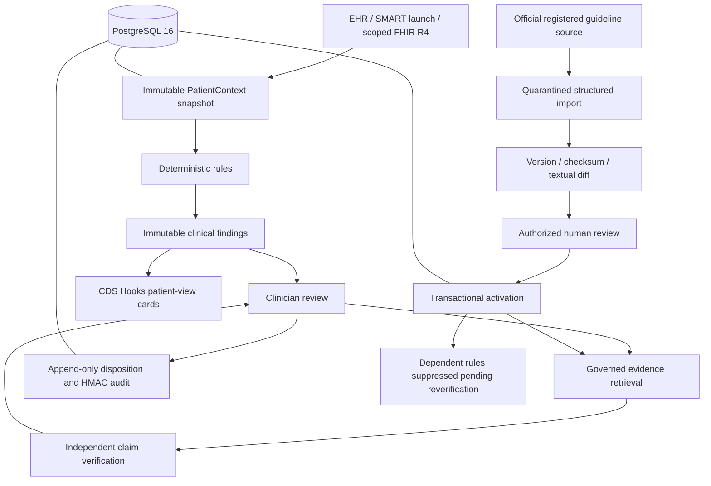

# Medical AI Copilot

## Evidence-Grounded Clinical Review & Guideline Intelligence Platform

Medical AI Copilot combines deterministic clinical rules, lifecycle-governed medical evidence, FHIR patient context, claim-level grounding, clinician feedback, and SMART/CDS interfaces. It is a synthetic-data engineering demonstration, not a clinical deployment or medical device.

A generic medical chatbot cannot establish record completeness, preserve the patient snapshot behind a decision, determine whether a guideline version is current, or make generated claims independently verifiable. This application makes those boundaries explicit. **Patient Review is the primary workflow; Ask Evidence is a supporting workflow.**

### Implemented clinical scope

Two deterministic annual-review rules cover adults with hypertension and adults with type 2 diabetes requiring foot assessment. Rules distinguish satisfied, potential care gap, insufficient data, not applicable, and suppressed. Dates, applicability, observation selection, and record coverage are code decisions. Unknown coverage cannot establish a care gap. There is no diagnosis, prescribing, medication-selection engine, or LLM clinical threshold logic.

### Architecture


```mermaid
flowchart TD
    EHR[EHR / SMART launch / scoped FHIR R4] --> PC[Immutable PatientContext snapshot]
    PC --> R[Deterministic rules]
    R --> F[Immutable clinical findings]
    F --> C[Clinician review]
    F --> CDS[CDS Hooks patient-view cards]
    C --> E[Governed evidence retrieval]
    E --> V[Independent claim verification]
    V --> C
    C --> A[Append-only disposition and HMAC audit]
    G[Official registered guideline source] --> Q[Quarantined structured import]
    Q --> D[Version / checksum / textual diff]
    D --> H[Authorized human review]
    H --> ACT[Transactional activation]
    ACT --> E
    ACT --> RR[Dependent rules suppressed pending reverification]
    DB[(PostgreSQL 16)] --- PC
    DB --- A
    DB --- ACT
```

Evidence retrieval filters lifecycle and jurisdiction before normalized cosine search and cached BM25, combines ranks with weighted RRF, then applies a bounded cross-encoder. Generated claims require valid evidence IDs, consistent registry metadata, and independent semantic support. An unavailable verifier produces uncertainty and removes unsupported claims. Retrieved content is untrusted data. Conflicts are surfaced without choosing an automatic winner.

The bundled old NG28 and NG19 PDFs remain superseded. Current NG19 recommendation evidence is governed separately and does not promote its old PDF. Activated structured releases overlay immutable, checksummed baseline artifacts through a PostgreSQL pointer; historical releases remain accessible.

### Run locally

Requires Docker Compose. These commands use development credentials and synthetic fixtures only:

```bash
cp .env.example .env
# Set independent random DEV_JWT_KEY and AUDIT_HMAC_KEY (at least 32 characters).
docker compose up -d --build --wait
docker compose exec -T api python -m scripts.docker_smoke
docker compose exec -T api python -m scripts.verify_audit_chain
```

Open **http://localhost:18000/**. The HTML application provides Patient Review, Review Findings, Ask Evidence, Guideline Intelligence, and System Status. Load a synthetic fixture, inspect its availability and timeline, create a snapshot-bound review, evaluate with an explicit review date/coverage declaration, and record a disposition. Missing information has a distinct status. The older Streamlit entry point remains an optional evidence/review client.

Compose runs PostgreSQL 16, a one-shot Alembic migration service, and the API as a non-root user. Readiness checks PostgreSQL and artifact provenance; liveness checks the process. PostgreSQL uses host port 55432. Stop with `docker compose down`; keep the named data volume. Do not delete volumes to resolve an ordinary migration issue.

Ask Evidence can use the configured Groq provider; no provider key is needed for tests, evaluation, or the controlled Docker smoke. Without an available generator/verifier, answers abstain. Local model downloads are required for real retrieval/model evaluation; pinned revisions are in `model_manifest.json`.

For Python development:

```bash
python3.11 -m venv .venv
# Activate the virtual environment for your shell.
pip install -r requirements-dev.txt
# Configure .env from .env.example and start PostgreSQL.
alembic upgrade head
uvicorn api_server:app --host 127.0.0.1 --port 18000 --no-access-log
```

Production mode requires OIDC issuer, audience, JWKS URL, independent audit key, and explicit CORS origins. The development anonymous clinician has no guideline activation permission. A signed editor/admin JWT is required for governance; the browser holds a supplied JWT only in memory. See [operations and security](SECURITY.md).

### Interoperability and governance

- [SMART and CDS Hooks](INTEROPERABILITY.md): SMART 2.2.0 public client with PKCE, single-use state, registered endpoints, server-side token use, and scoped synthetic FHIR ingestion. CDS Hooks 2.0.1 implements patient-view 1.0 with informational evidence-backed cards.
- [ABDM mapping](ABDM_MAPPING.md): selected profiles from the published `ndhm.in#6.5.0` package, FHIR 4.0.1. This is compatibility analysis, not certification or ABHA integration.
- [Guideline intelligence](GUIDELINE_INTELLIGENCE.md): trusted origins, bounded acquisition, quarantine, recommendation diff, authorized approval/activation, rule impact, and historical preservation. No internet crawler or automatic clinical activation.
- [Evaluation](EVALUATION.md): versioned development/held-out model sets and deterministic regression contracts; machine-readable metrics and failing gates.
- [Known limitations](KNOWN_LIMITATIONS.md), [clinical semantics](CLINICAL_RULES.md), [knowledge governance](KNOWLEDGE_GOVERNANCE.md), [patient context](PATIENT_CONTEXT.md), [production architecture](PRODUCTION_ARCHITECTURE.md).

### Verification

```bash
ruff check .
ruff format --check .
mypy
pytest --cov=backend --cov=embeddings --cov-report=term-missing
python -m eval.run_all
python -m scripts.cache_models
python -m eval.run_all --models
python -m scripts.security_audit
bandit -r backend embeddings api_server.py app.py scripts
python -m scripts.release_check
```

Set `PHASE5_TEST_DATABASE_URL` to a migrated, isolated PostgreSQL test database to include database tests; set `RUN_MODEL_INTEGRATION=1` to include the local-model integration test. `python -m eval.run_all --models --postgres` includes PostgreSQL contracts. No paid provider, live NICE endpoint, OIDC provider, or SMART sandbox is required by CI. GitHub Actions has tests, postgres, evaluation, security, and docker jobs. Branch protection must be configured separately; workflow presence alone does not enforce merge policy.

The internal model corpus contains 42 retrieval cases and 50 claim/evidence cases, with separate development and held-out splits. These are engineering measurements, not clinical validation or an accuracy guarantee. The executed [final system report](eval/final_system_report.json) records counts, model metrics, safety results, thresholds, environment, timestamp, and source SHA. [Release metadata](release_manifest.json) binds registry/index checksums, schema and standard versions to the evaluated source.

### Safety boundaries

Synthetic patients only. This project is not a substitute for clinical judgment and is not offered as a medical device. It does not autonomously diagnose or prescribe. Its scope is limited to implemented rules. Evidence freshness requires human governance, and semantic verification has false negatives and uncertainty. Historical evidence is visibly labeled. SMART tokens are not stored in browser persistence or logs. CDS cards do not execute orders. No HIPAA, FDA, ABDM, NHA, or NHS approval/certification claim is made.
